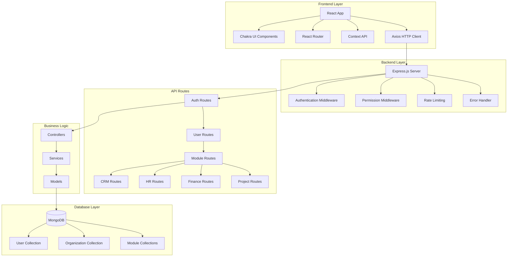
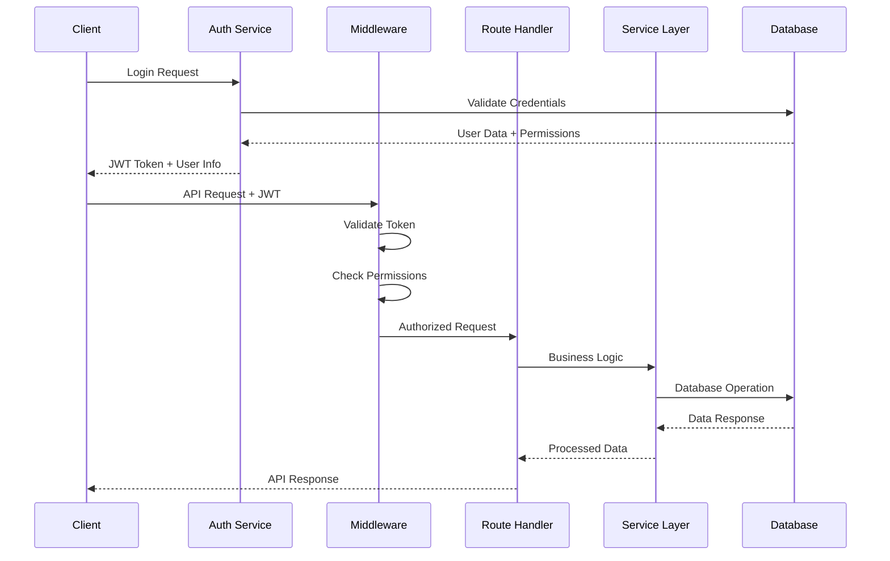
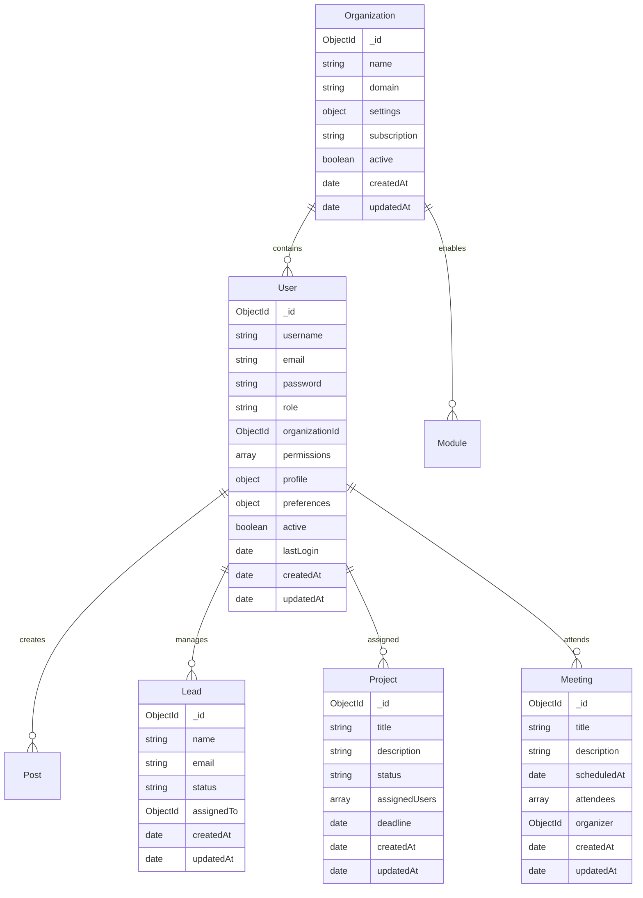
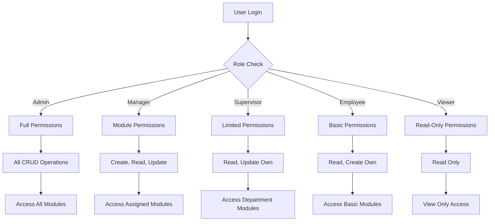

# Role-Based Access Control (RBAC) System

A comprehensive enterprise-grade Role-Based Access Control system built with the MERN stack, featuring modular architecture, advanced security, and multi-tenant support.

## 🚀 Project Overview

This RBAC system provides a scalable solution for managing user permissions across multiple business modules including CRM, HR, Finance, Projects, and Inventory management. The system implements fine-grained permission control with organizational multi-tenancy.

### Key Features

- **Multi-tenant Architecture**: Organization-based user isolation
- **Granular Permissions**: Module-specific CRUD permissions
- **Modular Design**: Pluggable business modules (CRM, HR, Finance, Projects)
- **Advanced Security**: JWT authentication, bcrypt hashing, rate limiting
- **Real-time Updates**: Live data synchronization
- **Responsive UI**: Modern React interface with Chakra UI
- **Audit Logging**: Comprehensive activity tracking

## 🏗️ System Architecture



## 📊 Data Flow Architecture



## 🗄️ Database Schema



## 🔐 Permission System


--- 
## 📷Screenshots


---

## 🛠️ Technology Stack

### Frontend
- **React 18.2.0** - UI Library
- **TypeScript** - Type Safety
- **Chakra UI 2.10.9** - Component Library
- **React Router 6.30.1** - Navigation
- **Axios 1.13.2** - HTTP Client
- **React Hook Form 7.66.0** - Form Management
- **Framer Motion 10.18.0** - Animations
- **Recharts 2.15.4** - Data Visualization

### Backend
- **Node.js** - Runtime Environment
- **Express.js 4.18.2** - Web Framework
- **MongoDB** - Database
- **Mongoose 7.6.3** - ODM
- **JWT** - Authentication
- **bcryptjs 2.4.3** - Password Hashing
- **Winston 3.11.0** - Logging
- **Express Rate Limit** - API Protection

## 📁 Project Structure

```
Role-Based Access Control/
├── frontend/
│   ├── src/
│   │   ├── components/
│   │   │   ├── layouts/
│   │   │   ├── navigation/
│   │   │   └── shared/
│   │   ├── contexts/
│   │   ├── hooks/
│   │   ├── modules/
│   │   │   ├── crm/
│   │   │   ├── hr/
│   │   │   ├── finance/
│   │   │   └── projects/
│   │   ├── pages/
│   │   ├── services/
│   │   ├── types/
│   │   └── utils/
│   └── package.json
├── backend/
│   ├── src/
│   │   ├── config/
│   │   ├── controllers/
│   │   ├── middleware/
│   │   ├── models/
│   │   ├── modules/
│   │   │   ├── crm/
│   │   │   ├── hr/
│   │   │   ├── finance/
│   │   │   └── projects/
│   │   ├── routes/
│   │   ├── seeders/
│   │   └── server.js
│   ├── scripts/
│   └── package.json
└── docs/
```

## 🚀 Quick Start

### Prerequisites
- Node.js (v16 or higher)
- MongoDB (v4.4 or higher)
- npm or yarn

### Installation

1. **Clone the repository**
```bash
git clone <repository-url>
cd Role-Based\ Access\ Control
```

2. **Backend Setup**
```bash
cd backend
npm install
cp .env.example .env
# Configure your environment variables
npm run dev
```

3. **Frontend Setup**
```bash
cd frontend
npm install
npm start
```

4. **Database Setup**
```bash
# Create test users
cd backend
npm run seed:users
```

### Environment Variables

**Backend (.env)**
```env
PORT=3001
MONGODB_URI=mongodb://localhost:27017/rbac
JWT_SECRET=your-super-secret-jwt-key
REFRESH_TOKEN_SECRET=your-refresh-token-secret
CLIENT_URL=http://localhost:3000
NODE_ENV=development
```

**Frontend (.env)**
```env
REACT_APP_API_URL=http://localhost:3001/api
```

## 👥 Test Credentials

| Role | Email | Password | Permissions |
|------|-------|----------|-------------|
| Admin | admin@test.com | Admin123! | Full system access |
| Manager | editor@test.com | Editor123! | Module management |
| Viewer | viewer@test.com | Viewer123! | Read-only access |

## 🔄 API Endpoints

### Authentication
- `POST /api/auth/register` - User registration
- `POST /api/auth/login` - User login
- `POST /api/auth/logout` - User logout
- `GET /api/auth/me` - Get current user
- `POST /api/auth/refresh-token` - Refresh JWT token

### User Management
- `GET /api/users` - List users
- `GET /api/users/:id` - Get user details
- `PUT /api/users/:id` - Update user
- `DELETE /api/users/:id` - Delete user

### Module APIs
- `GET /api/crm/leads` - CRM leads
- `GET /api/projects` - Project management
- `GET /api/hr/meetings` - HR meetings
- `GET /api/posts` - General posts

## 🔒 Security Features

- **JWT Authentication** with refresh tokens
- **Password Hashing** using bcrypt
- **Rate Limiting** (100 requests per 15 minutes)
- **CORS Protection** with configurable origins
- **Input Validation** using express-validator
- **Error Handling** with custom middleware
- **Audit Logging** for all operations

## 📊 Module Features

### CRM Module
- Lead management with Kanban board
- Contact tracking and history
- Deal pipeline visualization
- Lead conversion analytics

### HR Module
- Employee directory and profiles
- Meeting scheduling and management
- Leave request system
- Performance tracking

### Finance Module
- Expense tracking and categorization
- Revenue dashboard and analytics
- Financial reporting
- Budget management

### Project Module
- Project creation and assignment
- Task management with updates
- Team collaboration tools
- Progress tracking

## 🎨 UI Components

### Dashboard Features
- **Analytics Dashboard** - Key metrics and KPIs
- **Module Cards** - Quick access to business modules
- **Recent Activity** - Latest system activities
- **User Profile** - Personal settings and preferences

### Admin Panel
- **User Management** - CRUD operations for users
- **Role Assignment** - Dynamic permission management
- **Organization Settings** - Multi-tenant configuration
- **System Monitoring** - Health checks and logs

## 📈 Performance Optimizations

- **Code Splitting** - Lazy loading of modules
- **Caching Strategy** - Redis integration ready
- **Database Indexing** - Optimized queries
- **API Rate Limiting** - DDoS protection
- **Error Boundaries** - Graceful error handling

## 🔮 Future Enhancements

### Planned Features
- [ ] Real-time notifications with WebSocket
- [ ] Advanced reporting and analytics
- [ ] Mobile application (React Native)
- [ ] Third-party integrations (Slack, Teams)
- [ ] Advanced workflow automation
- [ ] Multi-language support
- [ ] Two-factor authentication
- [ ] API documentation with Swagger

---

**This project is build by Manan and [simran](https://github.com/simzl10)**
