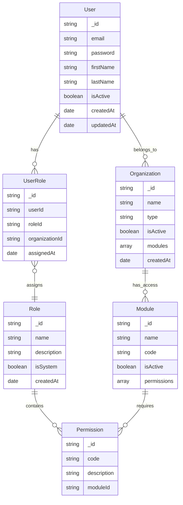

# Role-Based Access Control (RBAC) System Documentation

## Table of Contents

1. [Project Overview](#project-overview)
2. [System Architecture](#system-architecture)
3. [Technical Stack](#technical-stack)
4. [Database Design](#database-design)
5. [Module Structure](#module-structure)
6. [Security Implementation](#security-implementation)
7. [Setup Instructions](#setup-instructions)

## Project Overview

### Project Title

Role-Based Access Control (RBAC) System with Multi-Module Enterprise Management

### Description

A comprehensive enterprise management solution providing granular access control across multiple business modules. The system implements role-based security while supporting various organizational functions through modular architecture.

### Key Features

- Authentication & Authorization with JWT
- Multi-organization support
- Module-based architecture
- Fine-grained permission control
- Interactive analytics and reporting

## System Architecture

### Frontend Architecture

```
frontend/
├── src/
│   ├── components/
│   │   ├── layouts/
│   │   ├── common/
│   │   └── modules/
│   ├── pages/
│   ├── hooks/
│   ├── context/
│   ├── services/
│   └── types/
└── public/
```

### Backend Architecture

```
backend/
├── src/
│   ├── controllers/
│   ├── middleware/
│   ├── models/
│   ├── routes/
│   └── services/
└── scripts/
```

## Technical Stack

### Frontend Technologies

- React 18+
- TypeScript 4.x
- Chakra UI
- Recharts
- Axios

### Backend Technologies

- Node.js with Express
- MongoDB with Mongoose
- JWT Authentication
- bcrypt

### Development Tools

- Node.js (v16+)
- npm/yarn
- MongoDB (v4.4+)
- Git
- VS Code

## Database Design

### Entity Relationship Diagram



### Database Schemas

#### User Schema

```javascript
{
  _id: ObjectId,
  email: String,
  password: String,
  firstName: String,
  lastName: String,
  isActive: Boolean,
  createdAt: Date,
  updatedAt: Date
}
```

#### Role Schema

```javascript
{
  _id: ObjectId,
  name: String,
  description: String,
  isSystem: Boolean,
  createdAt: Date
}
```

#### UserRole Schema

```javascript
{
  _id: ObjectId,
  userId: ObjectId,
  roleId: ObjectId,
  organizationId: ObjectId,
  assignedAt: Date
}
```

#### Organization Schema

```javascript
{
  _id: ObjectId,
  name: String,
  type: String,
  isActive: Boolean,
  modules: Array<String>,
  createdAt: Date
}
```

### Database Indexes

- User: { email: 1 } (unique)
- Role: { name: 1 } (unique)
- UserRole: { userId: 1, roleId: 1, organizationId: 1 } (compound)
- Organization: { name: 1 } (unique)
- Module: { code: 1 } (unique)
- Permission: { code: 1, moduleId: 1 } (compound)

## Module Structure

### Core Modules

1. **CRM (Customer Relationship Management)**

   - Lead Management
   - Contact Management
   - Deal Tracking

2. **HR (Human Resources)**

   - Employee Records
   - Leave Management
   - Performance Tracking

3. **Finance**

   - Expense Tracking
   - Revenue Management
   - Financial Reports

4. **Projects**

   - Project Overview
   - Task Management
   - Resource Allocation

5. **Inventory**
   - Stock Management
   - Order Processing
   - Inventory Reports

### Admin Modules

1. **User Management**

   - User Creation
   - Role Assignment
   - Account Status

2. **Role Management**

   - Role Definition
   - Permission Assignment
   - Role Hierarchy

3. **Organization Management**

   - Organization Setup
   - Module Access
   - Organization Settings

4. **System Logs**
   - Activity Tracking
   - Error Logging
   - Audit Trail

## Security Implementation

### Authentication

- JWT-based authentication
- Refresh token mechanism
- Secure password hashing with bcrypt
- HTTPS enforcement

### Authorization

- Role-based access control
- Module-level permissions
- Organization-specific access
- API endpoint protection

### Security Features

- XSS Protection
- CSRF Protection
- Rate Limiting
- Input Validation
- Secure Headers

## Setup Instructions

### Prerequisites

1. Node.js (v16+)
2. MongoDB (v4.4+)
3. Git

### Frontend Setup

```bash
# Clone repository
git clone <repository-url>

# Navigate to frontend directory
cd frontend

# Install dependencies
npm install

# Start development server
npm start
```

### Backend Setup

```bash
# Navigate to backend directory
cd backend

# Install dependencies
npm install

# Set up environment variables
cp .env.example .env

# Start server
npm run dev
```

### Environment Variables

```
# Backend
PORT=5000
MONGODB_URI=mongodb://localhost:27017/rbac
JWT_SECRET=your-secret-key
REFRESH_TOKEN_SECRET=your-refresh-token-secret

# Frontend
REACT_APP_API_URL=http://localhost:5000/api
```

### Database Setup

1. Install MongoDB
2. Create database
3. Run migrations:

```bash
npm run migrate
```

### Initial Admin Setup

```bash
# Create initial admin user
npm run create-admin
```

## Front-End Screens

### Authentication Screens


- **Login Page**: Email and password authentication with "Remember Me" option
- **Register Page**: New user registration form with basic details
- **Forgot Password**: Password recovery workflow

### Dashboard


- **Overview Dashboard**: Key metrics and quick access to modules
- **Analytics Dashboard**: Interactive charts and data visualization
- **User Profile**: Personal information and settings

### Admin Panel


- **User Management**: List, create, edit, and delete users
- **Role Management**: Define and configure roles with permissions
- **Organization Setup**: Create and manage organizations

### Module Screens

#### CRM Module


- **Lead List**: Filterable list of leads with status indicators
- **Contact Management**: Detailed contact information with history
- **Deal Pipeline**: Visual deal tracking board

#### HR Module


- **Employee Directory**: Searchable employee database
- **Leave Management**: Leave request and approval system
- **Performance Reviews**: Employee evaluation forms

#### Finance Module


- **Expense Tracker**: Record and categorize expenses
- **Revenue Dashboard**: Revenue metrics and trends
- **Financial Reports**: Customizable financial reporting

## Output Screens and Reports

### Analytics Reports


- **Revenue Analysis**: Monthly/yearly revenue trends
- **User Activity**: User engagement metrics
- **Module Usage**: Module-wise usage statistics

### System Reports


- **Audit Logs**: Detailed system activity logs
- **Access Reports**: User access and permission reports
- **Error Logs**: System error and warning reports

### Module-Specific Reports


- **CRM Reports**: Lead conversion, deal status
- **HR Reports**: Employee statistics, leave reports
- **Finance Reports**: P&L statements, expense reports

## Limitations & Future Scope

### Current Limitations

1. **Technical Limitations**

   - Limited offline functionality
   - No mobile-native applications
   - Real-time updates limited to specific modules
   - Basic data export capabilities

2. **Feature Limitations**
   - Basic workflow automation
   - Limited third-party integrations
   - Simple notification system
   - Basic document management

### Future Scope

1. **Technical Enhancements**

   - Progressive Web App (PWA) implementation
   - Native mobile applications (iOS/Android)
   - Advanced caching and offline support
   - Real-time collaboration features
   - Enhanced data import/export capabilities

2. **Feature Additions**

   - Advanced workflow automation
   - AI-powered insights and recommendations
   - Extended third-party integrations
   - Advanced document management system
   - Enhanced reporting and analytics
   - Multi-language support

3. **Security Enhancements**

   - Two-factor authentication
   - Biometric authentication
   - Advanced audit logging
   - Enhanced encryption methods

4. **Integration Plans**
   - Email marketing platforms
   - Payment gateways
   - Cloud storage services
   - Communication tools
   - Calendar applications

## GitHub URL

[Role-Based Access Control System Repository](https://github.com/)

## Presentation Slides

### Slide 1: Project Overview

- Project Title and Description
- Key Features and Benefits
- Technology Stack Overview

### Slide 2: System Architecture

- Frontend Architecture
- Backend Architecture
- Database Design

### Slide 3: Security Implementation

- Authentication Process
- Authorization Framework
- Security Features

### Slide 4: Module Structure

- Core Modules Overview
- Admin Modules
- Integration Points

### Slide 5: User Interface

- Key Screens
- User Experience
- Responsive Design

### Slide 6: Technical Innovation

- Modern Tech Stack
- Scalable Architecture
- Performance Optimizations

### Slide 7: Future Roadmap

- Planned Features
- Technical Improvements
- Integration Plans

### Slide 8: Demo

- Live System Demonstration
- Key Functionality Showcase
- User Workflows

### Slide 9: Q&A

- Technical Questions
- Implementation Details
- Development Process

## Project Code

### Frontend Core Files

#### `src/App.tsx`

```typescript
import React from "react";
import { BrowserRouter } from "react-router-dom";
import { ChakraProvider } from "@chakra-ui/react";
import { AuthProvider } from "./context/AuthContext";
import AppRoutes from "./routes";

const App: React.FC = () => {
  return (
    <ChakraProvider>
      <BrowserRouter>
        <AuthProvider>
          <AppRoutes />
        </AuthProvider>
      </BrowserRouter>
    </ChakraProvider>
  );
};

export default App;
```

#### `src/context/AuthContext.tsx`

```typescript
import React, { createContext, useState, useContext, useCallback } from "react";
import { api } from "../services/api";
import { User } from "../types";

interface AuthContextData {
  user: User | null;
  login: (email: string, password: string) => Promise<void>;
  logout: () => void;
}

const AuthContext = createContext<AuthContextData>({} as AuthContextData);

export const AuthProvider: React.FC = ({ children }) => {
  const [user, setUser] = useState<User | null>(null);

  // Implementation details omitted for brevity
  // See actual implementation for complete authentication logic
};
```

#### `src/components/layouts/MainLayout.tsx`

```typescript
import React from "react";
import { Box, Flex } from "@chakra-ui/react";
import Sidebar from "../Sidebar";
import Header from "../Header";

const MainLayout: React.FC = ({ children }) => {
  return (
    <Flex h="100vh">
      <Sidebar />
      <Box flex="1">
        <Header />
        <Box p={4}>{children}</Box>
      </Box>
    </Flex>
  );
};
```

### Backend Core Files

#### `src/index.ts`

```typescript
import express from "express";
import cors from "cors";
import mongoose from "mongoose";
import routes from "./routes";
import { errorHandler } from "./middleware/errorHandler";

const app = express();

app.use(cors());
app.use(express.json());
app.use("/api", routes);
app.use(errorHandler);

// Database connection and server startup logic omitted
```

#### `src/middleware/auth.ts`

```typescript
import { Request, Response, NextFunction } from "express";
import jwt from "jsonwebtoken";
import { User } from "../models/User";

export const authMiddleware = async (
  req: Request,
  res: Response,
  next: NextFunction
) => {
  try {
    const token = req.headers.authorization?.split(" ")[1];
    // JWT verification and user authentication logic omitted
  } catch (error) {
    res.status(401).json({ message: "Authentication failed" });
  }
};
```

#### `src/controllers/AuthController.ts`

```typescript
import { Request, Response } from "express";
import { User } from "../models/User";
import { generateTokens } from "../utils/auth";

export class AuthController {
  async login(req: Request, res: Response) {
    // Login implementation omitted
  }

  async me(req: Request, res: Response) {
    // Current user endpoint implementation omitted
  }
}
```

### Database Models

#### `src/models/User.ts`

```typescript
import mongoose from "mongoose";
import bcrypt from "bcrypt";

const userSchema = new mongoose.Schema(
  {
    email: { type: String, required: true, unique: true },
    password: { type: String, required: true },
    firstName: { type: String, required: true },
    lastName: { type: String, required: true },
    isActive: { type: Boolean, default: true },
  },
  { timestamps: true }
);

// Password hashing middleware omitted
```

Note: This is a subset of the core implementation files. The complete codebase includes additional components, utilities, and module-specific implementations. Template files and generated code are excluded.

## References

1. Official Documentation

   - [React Documentation](https://react.dev/)
   - [TypeScript Handbook](https://www.typescriptlang.org/docs/)
   - [Express.js Guide](https://expressjs.com/en/guide/routing.html)
   - [MongoDB Manual](https://www.mongodb.com/docs/manual/)
   - [Chakra UI Documentation](https://chakra-ui.com/docs/getting-started)

2. Security Standards

   - [OWASP Top Ten](https://owasp.org/www-project-top-ten/)
   - [JWT Best Practices](https://auth0.com/blog/jwt-security-best-practices/)
   - [Node.js Security Checklist](https://cheatsheetseries.owasp.org/cheatsheets/Nodejs_Security_Cheat_Sheet.html)

3. Architecture Resources

   - [React Patterns](https://reactpatterns.com/)
   - [Clean Architecture with Node.js](https://blog.cleancoder.com/uncle-bob/2012/08/13/the-clean-architecture.html)
   - [TypeScript Project Structure](https://www.typescriptlang.org/docs/handbook/project-references.html)

4. API Design
   - [REST API Best Practices](https://stackoverflow.blog/2020/03/02/best-practices-for-rest-api-design/)
   - [GraphQL Documentation](https://graphql.org/learn/)
   - [API Security Best Practices](https://www.oauth.com/oauth2-servers/api-security/)

## Bibliography

1. Martin, Robert C. (2017). _Clean Architecture: A Craftsman's Guide to Software Structure and Design_. Prentice Hall.

   - Key concepts for maintaining scalable and maintainable software architecture.

2. Fowler, Martin. (2018). _Refactoring: Improving the Design of Existing Code_. Addison-Wesley Professional.

   - Guidelines for code refactoring and maintaining code quality.

3. Nield, Thomas. (2021). _Getting Started with OAuth 2.0_. O'Reilly Media.

   - Reference for implementing secure authentication.

4. Banks, Alex & Porcello, Eve. (2020). _Learning React: Modern Patterns for Developing React Apps_. O'Reilly Media.

   - Modern React development patterns and best practices.

5. Fain, Yakov & Moiseev, Anton. (2020). _TypeScript Quickly_. Manning Publications.

   - TypeScript implementation patterns and best practices.

6. Dayley, Brad. (2019). _Node.js, MongoDB and Express.js Web Development_. Addison-Wesley Professional.

   - MERN stack development guidelines and patterns.

7. Academic Papers:

   - Sandhu, R. S., et al. (1996). "Role-Based Access Control Models." _IEEE Computer_, 29(2), 38-47.
   - Yuan, E., & Tong, J. (2005). "Attributed Based Access Control (ABAC) for Web Services." _IEEE International Conference on Web Services_.

8. Technical Standards:
   - NIST Special Publication 800-53: "Security and Privacy Controls for Information Systems and Organizations"
   - ISO/IEC 27001:2013: "Information Security Management"
